# 分区

# 面部浅层结构
## 临床联系
1. 手术时应将面部皮肤、面肌分层缝合，以免瘢痕过大。面部手术切口应尽可能与皮纹走向一致，这样可以减少愈合后的瘢痕，不至于影响美观。
2. 危险三角：两侧口角至鼻根连线所形成的三角形区域。(教材第13页面静脉)
# 面侧区
位于颧弓、鼻唇沟、下颌骨下缘与胸锁乳突肌上份前缘之间的区域，包括颊区、腮腺咬肌区和面侧深区。
## 临床联系
1. 翼点处骨质薄弱，若骨折，常扯裂血管，引起颅内出血。
2. 在进行下颌手术时，可在下颌孔及颏孔处麻醉下牙槽神经。
## 腮腺咬肌区
* 咬肌筋膜(P16)
* 腮腺(P17)
* 腮腺床(P19)
### 穿行腮腺的结构
* 纵行：颈外动脉、下颌后静脉、颞浅动静脉及耳颞神经
* 横行：上颌动、静脉，面横动、静脉，面神经分支
* 由浅入深：面神经分支、下颌后静脉、颈外动脉、耳颞神经
## 面侧深区
* 咀嚼肌：翼内、外肌
### 上颌动脉
以翼外肌为标志颏分为三段
#### 下颌段
第一段，自起点至翼外肌下缘。主要分支：下牙槽动脉、脑膜中动脉。
#### 颊肌段
第二段，位于翼外肌的浅面或深面。分支至翼内、外肌、咬肌和颊肌。另发出颊动脉与颊神经伴行。
#### 翼腭窝段
第三段，位于翼腭窝内。主要分支有上牙槽后动脉、眶下动脉。
### 下颌神经
是混合性神经，由特殊内脏运动纤维和一般躯体感觉纤维组成。感觉神经分支包括颊神经、耳颞神经、舌神经、下牙槽神经。运动神经分支为咀嚼肌神经。
# 面部的间隙

面部间隙示意图

## 咬肌间隙
位于咬肌与下颌支之间的狭隙。此间隙的前方紧邻下牙槽的第三磨牙，在患智齿冠周炎、牙槽脓肿、下颌骨骨髓炎时，可扩散至此间隙。  
此间隙的感染向前可扩至颊间隙，向下绕过下颌切迹可扩散至翼颌间隙和颞下窝，经颧弓深侧可至颞窝，向下可扩散至颌下间隙，甚至向后下可扩散至腮腺，导致腮腺脓肿。
## 翼下颌间隙
位于翼内肌与下颌支之间，与咬肌间隙仅隔以下颌支，两间经下颌切迹相通。前邻颊肌，后为腮腺。间隙内有舌神经，下牙槽神经，下牙槽动、静脉穿行，**下牙槽神经阻滞术**即将局麻药物注入此间隙内。**牙源性感染**常累及此间隙。  
翼下颌间隙感染可向上扩散至颞下窝和翼腭窝，向内沿翼内肌后可扩散至咽旁间隙，向下可扩散至下颌后窝，有时可沿血管神经束向上经卵圆孔蔓延到颅腔。
## 舌下间隙
位于下颌体的内侧，呈马蹄铁形，上界为口底黏膜，下界为下颌舌骨及舌骨舌肌，前外侧为下颌舌骨线以上的下颌骨体内侧面骨壁，后界止于舌根。间隙内有舌下腺、下颌下腺的深部及腺管、下颌下神经节、舌神经、舌下神经和舌下血管等。  
舌下肌间隙向后在下颌舌骨肌群后缘处与下颌下间隙相交通，向后上通翼下颌间隙，向前与对侧舌骨下间隙相交通。
